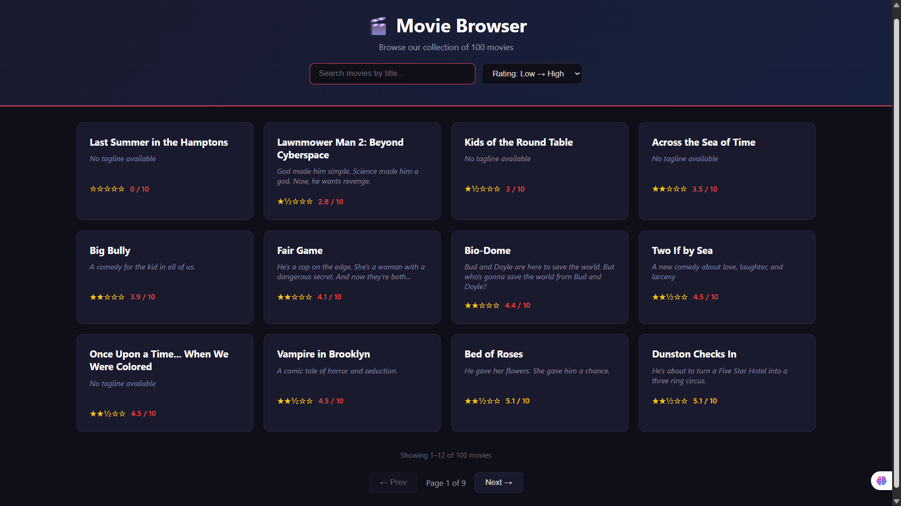
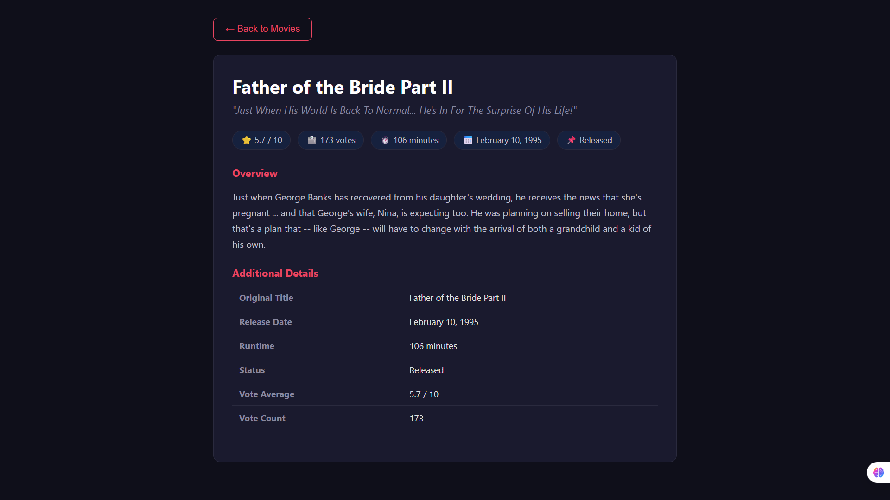

# 🎬 Movie Browser

A fullstack movie browser web application built with **React** and **Express**. Browse a collection of movies, view detailed information, search by title, sort by rating, and navigate with pagination.

## Features

- **Movie List** — Responsive grid layout (4 columns on desktop, 2 on tablet, 1 on mobile)
- **Movie Detail Page** — View all details including overview, runtime, localized release date, vote stats
- **Search** — Filter movies instantly by typing a title
- **Sort by Rating** — Sort movies from highest to lowest rating or vice versa
- **Pagination** — Browse movies 12 per page with Prev/Next navigation
- **Color-Coded Ratings** — Green (7+), Yellow (5–7), Red (below 5) for quick visual scanning
- **Keyboard Navigation** — Press `Escape` to return from detail view to the list
- **Dark Theme** — Clean, modern dark UI with smooth hover animations

## Tech Stack

| Layer | Technology |
|---|---|
| Frontend | React 16 |
| Backend | Node.js + Express |
| Styling | Vanilla CSS (responsive grid + dark theme) |
| Data | JSON file (`server/movies_metadata.json`) |

## Getting Started

### Prerequisites

- [Node.js](https://nodejs.org/) installed on your machine

### Installation

```bash
git clone https://github.com/Pawanr5/movie-browser.git
cd movie-browser
npm install
```

### Running the App

```bash
npm start
```

This starts both the React frontend and the Express backend concurrently:
- **Frontend**: http://localhost:3000
- **Backend API**: http://localhost:3001

## API Endpoints

| Method | Endpoint | Description |
|---|---|---|
| GET | `/api/movies` | Returns all movies |
| GET | `/api/movies/:id` | Returns a single movie by ID |

## Project Structure

```
├── server/
│   ├── server.js              # Express backend with API routes
│   └── movies_metadata.json   # Movie data (50+ movies)
├── src/
│   ├── App.js                 # Main React component (list + detail views)
│   ├── App.css                # All styling (responsive grid, dark theme)
│   ├── index.js               # React entry point
│   └── setupProxy.js          # Dev proxy (forwards /api to Express)
├── package.json
└── README.md
```


## Screenshots

### Movie List Page


### Movie Detail Page


## License

This project is licensed under the MIT License — see [LICENSE.md](LICENSE.md) for details.
